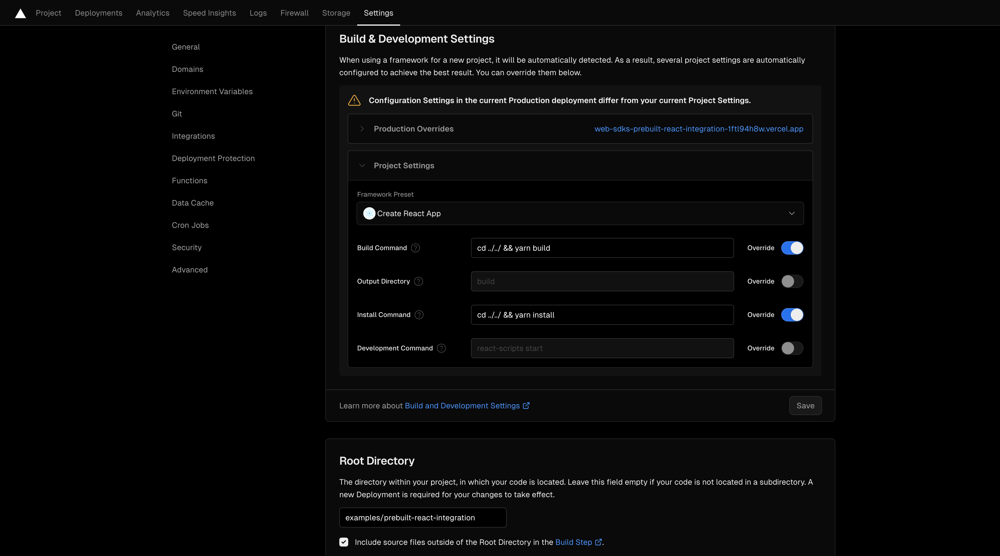

# Web SDKs

[](https://github.com/100mslive/web-sdks/actions/workflows/lint-test-build.yml)
[](https://www.100ms.live/docs/javascript/v2/release-notes/release-notes)
[](https://www.100ms.live/)
[](https://www.100ms.live/docs/javascript/v2/quickstart/javascript-quickstart)
[](https://dashboard.100ms.live/register)

This monorepo contains all the packages required to integrate 100ms on the web.

## What is included?

The packages folder contains all the SDK's of 100ms. Here is a brief overview:

| Directory | Package | Description | Link |
|--|--|--|--|
| `hms-video-store` | `@100mslive/hms-video-store` | This package contains the core SDK and the reactive store parts. | [README](./packages/hms-video-store) |
| `react-sdk` | `@100mslive/react-sdk` | This contains the base React Hooks and some commonly used functionalities as React Hooks. | [README](./packages/react-sdk) |
| `roomkit-react` | `@100mslive/roomkit-react`| This contains the React components used in the Prebuilt and the Prebuilt component itself. | [README](./packages/roomkit-react) |
| `roomkit-web` | `@100mslive/roomkit-web` | This is a web component port of the `HMSPrebuilt` component from the `roomkit-react`. If you are not using React, this can be used as a web component. | [README](./packages/roomkit-web)|
| `hls-player` | `@100mslive/hls-player` | This is a HLS player offered by 100ms that can be used to play live video streams. | [README](./packages/hls-player) |
| `hms-whiteboard` | `@100mslive/hms-whiteboard` | This contains APIs for integrating Whiteboard collaboration into your conferencing sessions. | [README](./packages/hms-whiteboard) |
| `hms-virtual-background` | `@100mslive/hms-virtual-background` | This contains the Virtual Background plugin provided by 100ms. | [README](./packages/hms-virtual-background) |
| `react-icons` | `@100mslive/react-icons` | This contains all the icons used in the 100ms prebuilt. | [README](./packages/react-icons) |

For full documentation, visit [100ms.live/docs](https://www.100ms.live/docs)

## How to integrate?

The 100ms SDK gives you everything you need to build scalable, high-quality live video and audio experiences.

**There are two ways you can add 100ms to your apps:**

1. ## Custom UI
   - 100ms SDKs are powerful and highly extensible to build and support all custom experiences and UI.
   - **Related packages include:** `@100mslive/react-sdk`, `@100mslive/hms-video-store` and `@100mslive/react-icons`.
   - Get started with integrating the SDK using the [How to Guide](https://www.100ms.live/docs/javascript/v2/how-to-guides/install-the-sdk/integration).

> Navigate to `react-sdk` for the base React Hooks and some commonly used functionalities by clicking [here](./packages/react-sdk).

2.  ## 100ms Prebuilt
    - 100ms Prebuilt is a high-level abstraction with no-code customization that enables you to embed video conferencing and/or live streaming UI—with a few lines of code.
    - **Related packages include:** `roomkit-react` and `roomkit-web`.
    - Get started with 100ms Prebuilt using the [Prebuilt Quickstart for Web](https://www.100ms.live/docs/javascript/v2/quickstart/prebuilt-quickstart).

> Navigate to `roomkit-react` for the React components used in Prebuilt and the Prebuilt component itself by clicking [here](./packages/roomkit-react).


### 100ms Prebuilt Cross Platform Support

| Client       | Repository                                                                                                     | Docs                                                                             | Example                                                                                                                           |
| ------------ | -------------------------------------------------------------------------------------------------------------- | -------------------------------------------------------------------------------- | --------------------------------------------------------------------------------------------------------------------------------- |
| Web          | [web-sdks](https://github.com/100mslive/web-sdks/tree/main/packages/roomkit-react)                             | [Link](https://www.100ms.live/docs/javascript/v2/quickstart/prebuilt-quickstart) | [prebuilt-react-integration](https://github.com/100mslive/web-sdks/tree/main/examples/prebuilt-react-integration)                 |
| Android      | [100ms-android](https://github.com/100mslive/100ms-android/tree/release-v2/room-kit)                           | [Link](https://www.100ms.live/docs/android/v2/quickstart/prebuilt-android)       | [AndroidPrebuiltDemo](https://github.com/100mslive/AndroidPrebuiltDemo)                                                           |
| iOS          | [100ms-roomkit-ios](https://github.com/100mslive/100ms-roomkit-ios)                                            | [Link](https://www.100ms.live/docs/ios/v2/quickstart/prebuilt)                   | [100ms-roomkit-example](https://github.com/100mslive/100ms-roomkit-example)                                                       |
| Flutter      | [100ms-flutter](https://github.com/100mslive/100ms-flutter/tree/main/packages/hms_room_kit)                    | [Link](https://www.100ms.live/docs/flutter/v2/quickstart/prebuilt)               | [hms_room_kit/example](https://github.com/100mslive/100ms-flutter/tree/main/packages/hms_room_kit/example)                        |
| React Native | [100ms-react-native](https://github.com/100mslive/100ms-react-native/tree/main/packages/react-native-room-kit) | [Link](https://www.100ms.live/docs/react-native/v2/quickstart/prebuilt)          | [react-native-room-kit/example](https://github.com/100mslive/100ms-react-native/tree/main/packages/react-native-room-kit/example) |

## Setup

### Local Setup

> Node version 18.0.0 or later

if you are using a different version in other projects, use [nvm](https://github.com/nvm-sh/nvm?tab=readme-ov-file#installing-and-updating) to manage node versions.

```bash
git clone https://github.com/100mslive/web-sdks.git
cd web-sdks
yarn install
yarn build
```

### Running Sample Prebuilt

```bash
cd examples/prebuilt-react-integration
yarn dev
```

`http://locahost:<port>/<room-code>`

Once you run `yarn dev`, the localhost link with the port will be generated automatically. Just get the roomCode from [100ms dashboard](https://dashboard.100ms.live) and append at the end

### Testing Changes Locally

Run `yarn start` by navigating to the package you are making changes to, the changes should reflect in the above sample app.

For example, if you are making changes in roomkit-react(prebuilt), run `yarn start` in that package. The sample app should auto reload.

> Note: Make sure `yarn build` is run atleast once before using `yarn start`.

### Deploying Your Changes

Once you have forked the repository and tested your changes on the local build, you can follow the steps below to deploy to Vercel as an example:

- Import the fork repository
- Set `examples/prebuilt-react-integration` as the root directory
- Use the Create React App preset and update the build and install commands `Project Settings` to use the root level scripts
  - install: `cd ../../ && yarn install`
  - build: `cd ../../ && yarn build`

For reference:




Once the app has been deployed, you can append the room code at the end of the deployment URL to preview your changes

### Maintaining A Forked Version

The following command will build the roomkit-react package and generate a .tgz file:

```bash
yarn && yarn build;
cd packages/roomkit-react;
yarn pack
```

Push your changes and the .tgz file to the forked repository and in the package.json of the app you are building, use the following link for the roomkit-react package:

```
"@100mslive/roomkit-react":"https://github.com/<user_name>/web-sdks/raw/main/packages/roomkit-react/<tgz_file_name>.tgz",
```

Re-install the dependencies after updating the package.json and build using the following command:

```
yarn && yarn build
```

You can now import the HMSPrebuilt component in the same way as before:

```
import { HMSPrebuilt } from '@100mslive/roomkit-react';
```

## Contributing

We welcome external contributors or anyone excited to help improve 100ms SDKs. If you'd like to get involved, check out our [contribution guide](./DEVELOPER.MD), and get started exploring the codebase.

## Community & Support

- [GitHub Issues](https://github.com/100mslive/web-sdks/issues) - Submit any bugs or errors you encounter using the Web SDKs.
- [Contact](https://www.100ms.live/contact) - Reach out to 100ms team to get pricing information, understand how we can help you go live, or to learn more about the platform.
