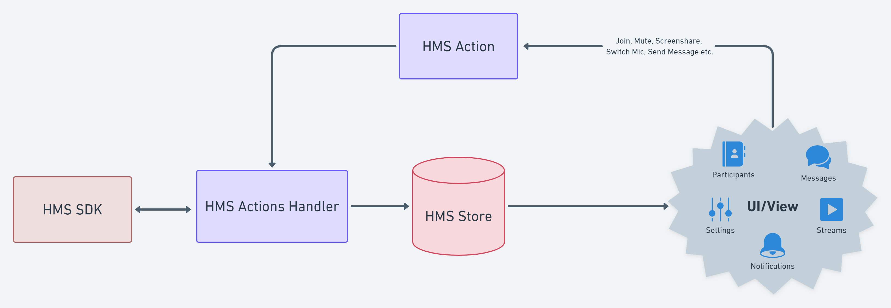
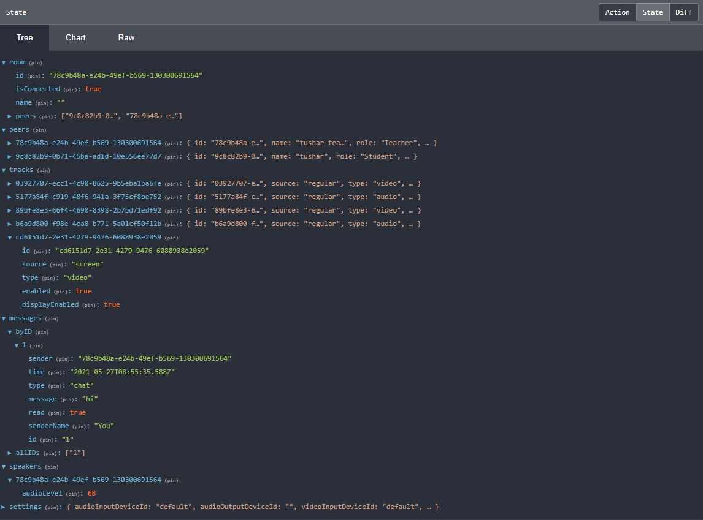
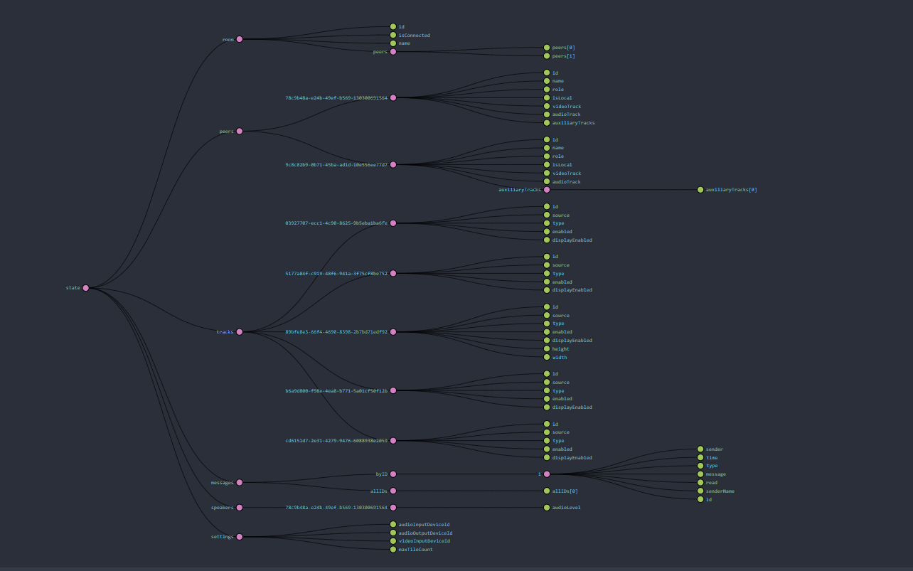

# 100ms Reactive Store

[](https://www.npmjs.com/package/@100mslive/hms-video-store)
[](https://github.com/100mslive/web-sdks/actions/workflows/lint-test-build.yml)
[](https://bundlephobia.com/result?p=@100mslive/hms-video-store)
[](https://www.100ms.live/)




This is an addon to the core sdk provided by 100ms. It abstracts away the
intricacies of data management and provides
a flux based reactive data store where data flows in only one direction.

The complexity of managing the state of a room is not a trivial task
and can spiral out of control very fast. For example, multiple UI components can be interested in a
simple data point such as whether the user is currently muted. The mute action
itself can be taken from multiple different places in the UI or even by a remote
participant. Local states and improper handling of actions or missing corner cases,
state duplication etc. have a high potential to make the data mutually inconsistent
and out of sync with the source of truth.

This is an opinionated reactive layer on top of our core sdk which takes some
control in order to provide an even easier usability and integration experience.
Your UI components can forget about local states, and tracking what actions are happening,
instead focusing only on giving the best possible experience to the end users.

There are two important pieces, store for what you want to show and actions for what
you want to do -
1. Store - The core store interface for reading data usually using selectors. The store
   acts as a single source of truth for any data related to the room. There are two exposed
   functions -
    * getState(selector) -> get the current state of the UI, true at the time of function call
    * subscribe(callback, selector) -> subscribe to a portion of the state selected by the
      passed in selector such that whenever the portion changes, the passed in callback is notified.
2. Actions - The actions interface for dispatching actions which in turn may reach
   out to server and update the store. Check the interface with detailed doc
   [here](./src/IHMSActions.ts).

We also provide optimized and efficient selectors for most common use cases. These are
available in [this folder](./src/selectors).

Important Note: The data received from either getState or Subscribe is immutable, the
object received is frozen, and it is not allowed to mutate it. You'll get an error
if you try to mutate this data in any way. Immutability of the store is how we ensure
it to be consistent and reflect the truth at any point of time.

### Installation
```
yarn add @100mslive/hms-video-store
```

### How To Use

```js
const hms = new HMSReactiveStore();
const hmsActions = hms.getHMSActions();
const hmsStore = hms.getStore();

const toggleAudio = () => {
    const isEnabled = hmsStore.getState(selectIsLocalAudioEnabled);
    hmsActions.setLocalAudioEnabled(!isEnabled);
}

const onSpeakerUpdate = (speaker, prevSpeaker) => {
    console.log("speaker changed from - ", prevSpeaker, ", to - ", speaker);
}

hmsStore.subscribe(onSpeakerUpdate, selectDominantSpeaker);
```

## Framework specific wrappers

Most of the popular javascript frameworks are reactive in nature and have some
kind of associated concept which can simplify development further. We plan to
provide a few framework specific wrappers as well for smoother integration.

### React

We provide two hooks one for reading for the store and another for taking actions.
We provide a HMSRoomProvider component which takes care of initialization and
making these hooks available to your UI components.

```jsx
function join() {
    const isConnected = useHMSStore(selectIsConnectedToRoom);
    const hmsActions = useHMSActions();

    return <>
        {
            !isConnected &&
            <Button onClick={() => hmsActions.join()}>Join</Button>
        }
    </>
}
```


## Out of Box Support for [Redux Devtools Extension](https://chrome.google.com/webstore/detail/redux-devtools/lmhkpmbekcpmknklioeibfkpmmfibljd?hl=en)

### Store State


### Store Graph


Refer to [docs](https://www.100ms.live/docs/javascript/v2/quickstart/javascript-quickstart) for more detailed guide